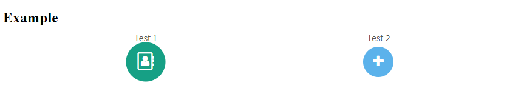

## Installation

```javascript
$ npm i ngx-horizontal-timeline
```
## Usage

### Import

```javascript
import { NgxHorizontalTimelineModule } from 'ngx-horizontal-timeline';
@NgModule({
  declarations: [
    AppComponent
  ],
  imports: [
    NgxHorizontalTimelineModule
    ...
  ],
  providers: [],
  bootstrap: [AppComponent]
})
export class AppModule { }
```
### Component

```javascript
import { TimelineItem } from 'ngx-horizontal-timeline';

...
items: TimelineItem[] = [];

ngOnInit() {
  this.items.push({
    label: 'Test 1',
    icon: 'fa fa-address-book-o',
    active: true,
    title: 'Example 1',
    color: '16a085',
    command() {
      console.log('Action 1');
    }
  });
  
  this.items.push({
    label: 'Test 2',
    icon: 'fa fa-plus',
    title: 'Example 2',
    color: '2980b9',
    command() {
      console.log('Action 2');
    }
  });
```
### Template

```html
<ngx-htl-horizontal-timeline [(items)]="items"></ngx-htl-horizontal-timeline>
```

### Live Example

https://stackblitz.com/edit/ngx-horizontal-timeline
